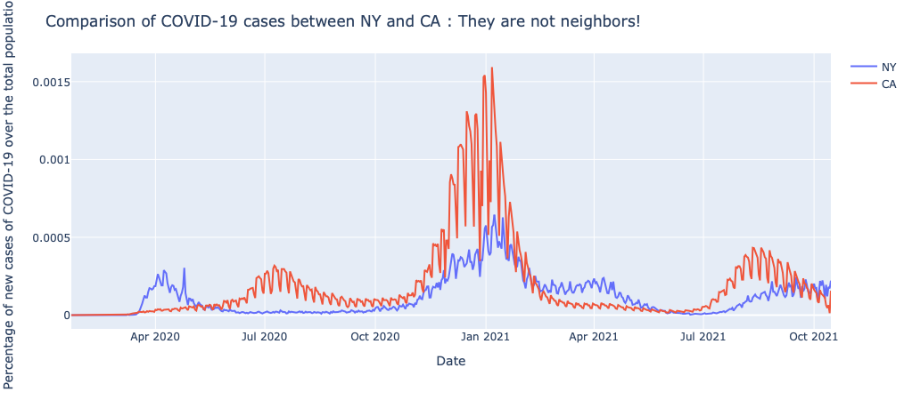
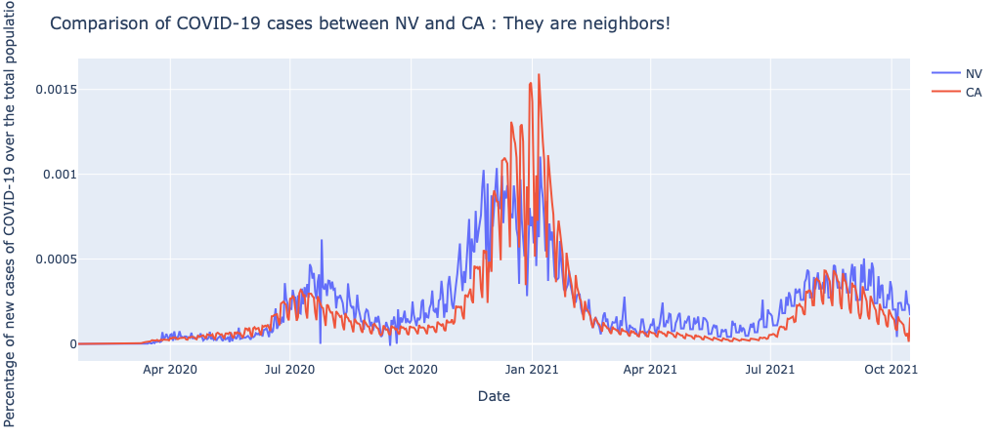
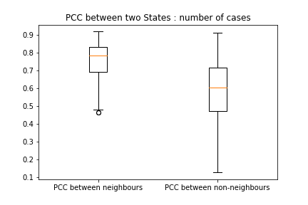
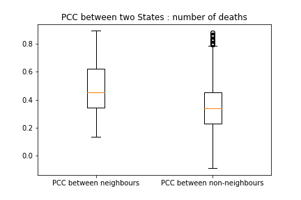

<style>
body {text-align: justify}
</style>

```{r setup, include=FALSE}
knitr::opts_chunk$set(echo = TRUE)
options(knitr.duplicate.label = "allow")
```

## Introduction
-statement of problem/circumstance
-significance of problem
-purpose of study
-assumptions and limitations
-Review of preceding research and literature


This project aim to understand the spread of COVID-19 and why the pandemic has emerged as a global matter of concern in a couple months.At the time of the pandemic outbreak, a lack of informations implied awereness in the general public.We want to show the gravity of COVID-19. To do so, we focused our interest on the United States. 

### Research questions:
In this investigation, we set out to answer the following questions.


1. How have the number of deaths due to COVID-19 in the United State evolved with time since the beginning of the pandemic?


2. Next, we investigate how COVID-19 deaths are distributed across some notable risk factors. In particular, we ask deaths are distributed across age groups? How are deaths distributed across the recorded location of death (meaning type of institution or private residence)?


3. How has the mortality of COVID-19 evolved with time?


4. How are COVID-19 cases correlated across neighbouring states?


5. Can we predict the number of deaths in a given state and given month from the number of deaths in the k-th degree neighbor of that state?

### Approaches:
To answer the above questions, we will proceed as follows:
A descriptive and visual approach where we will produce interactive plots with information on number of deaths along different dimensions: geographically, temporally and by different risk factors. We will then proceed with the analysis of mortality rate as a function of time and based on different risk factors. Afterwards we switch to the correlation and spatial comparison studies: between two selected states, two neighbouring states or considering different levels of neighbourhoods through a separation analysis.

## Sources of information/ datasets:

In this project, several datasets were used to answer our questions. Each one of them refers to the same population (the US). Here are more specific descriptions. 

### US deaths within categories and states

The first dataset we use is about [provisional COVID--19 deaths by place of death and age](https://data.cdc.gov/NCHS/Provisional-COVID-19-Deaths-by-Place-of-Death-and-/4va6-ph5s) from the CDC in the US. A complete description of it is available on the web page. 

The variables we used in this project are : `Group`, `Year`, `Month`,	`HHS Region`,	`State`,	`Place of Death`, `Age group`, `COVID-19 Deaths` and `Total Deaths`. What is particular here is that the sum of `COVID-19 Deaths` is not the total number of deaths in the US. Actually, we need to filter our data by `Group`, `State`, `Place of Death` and `Age Group` in order to get what we want.

A last thing we should take into account is that those numbers of deaths are not the exact number that happened during a given period. The reason is that there is always a lag in time (usually 1 to 8 weeks) between the instant when the death occurred and between when the death certificate is completed and submitted for reporting purposes. 

### US deaths within categories and states

The second dataset we chose to use is about [COVID-19 cases and Deaths by State over time](https://data.cdc.gov/Case-Surveillance/United-States-COVID-19-Cases-and-Deaths-by-State-o/9mfq-cb36) from the CDC in the US. This dataset contains the total number, probable and confirmed cases and deaths from COVID-19 from each State from 22nd of January 2020 to 15th of October 2021. The variables we used are : `submission_date`, `state`, `new_cases` and `new_deaths`. We wanted to focus on the number of new cases per day to compare them between the States. The reason why we chose a different dataset from above is because tracing the number of cases is more sensitive in catching the global trend of spread than tracing the number of new deaths. Also, the above dataset only has the number per month, whereas this has for each day which makes the comparison more accurate and precise. 

### Other datasets used

The third dataset we used is about [the U.S. population in 2019 by State (extract)](https://www.census.gov/data/datasets/time-series/demo/popest/2010s-national-total.html#par_textimage_1810472256) by the Census Bureau in the U.S.. This dataset is used to normalize the number of cases and deaths : since each state has a different size of population, we used the percentage of cases out of the total population of the state to compare the numbers from different States. We assumed that the population did not differ from 2019 with a confidence interval of 90% or above (The population of the States showed a global increase of less than 10% during 10 years)

The fourth dataset is about the new cases and deaths per months. This dataset was extracted by the second dataset, by subtracting the total cases and deaths for each last days of consecutive months. This dataset was made to use in parallel with the first dataset, and compute the mortality rate. 

## Packages

Here are some packages used in our project. Make sure they are installed before running the R Markdown file. Since the format of this Markdown is not standard, you need to install the *Distill* package. Instructions can be found on [Github](https://github.com/rstudio/distill).

````{r, message=FALSE}

library(readr)
library(dplyr) # Useful for reading variables containing spaces
library(ggplot2)
library(reshape)
library(stringr) # Labels overlap
library(scales) # Labels value format
library(usmap)
library(Rfast)

````


## Spatial exploration of Covid deaths in the United States over time:

In this subsection, we intend to visualize our data before starting different analyses. 
To do so, we display the number of deaths on the United States map shown in Figures (1), (2), (3) and (4). 
The plotted data represents the deaths per 1 million individuals, we standardise the data according to the population of each state.


````{r, include=FALSE}
# data :

df0<- read_csv("Data/Data_us_interactive_us_map.csv")
df1<- df0[,-c(1,17)]
# transforming the columns start date and end date to date format:
df3<-df1
df3$`Start Date`<- as.Date(df3$`Start Date`, format="%m/%d/%Y")
df3
df3$`End Date`<- as.Date(df3$`End Date`, format="%m/%d/%Y")
df3
#transform the other columns ( "Group","HHS Region","State","Place of Death" "Age group") into factors:
df4<-df3
#col_names <- colnames(df4[,4:10])
#df4[col_names] <- lapply(df4[col_names] , factor)
data_interactive<-df4
data_interactive<-as.data.frame(data_interactive)


us_popul<-statepop 
````

```{r,include=FALSE}
# functions I need: 
Select_Age_Group<-function(DataFrame, agegroup)
{ 
  age_groups<-unique(DataFrame$`Age group`)
  if(agegroup %in% age_groups)
  {
    df1= DataFrame %>% filter(`Age group` == agegroup )
    df1<-as.data.frame(df1)
    return(df1)
  }
  else{
    warning("Age group selected not in the list, the returned dataframe has not been filtered")
    return (DataFrame)
  }
}

Select_Group<-function(DataFrame, group)
{ 
  all_groups<-unique(DataFrame$`Group`)
  if(group %in% all_groups)
  {
    df1= DataFrame %>% filter(`Group` == group )
    df1<-as.data.frame(df1)
    return(df1)
  }
  else{
    warning("Group selected not in the list, the returned dataframe has not been filtered")
    return (DataFrame)
  }
}

Select_HHSRegion<-function(DataFrame, region)
{ 
  all_regions<-unique(DataFrame$`HHS Region`)
  if(region %in% all_regions)
  {
    df1= DataFrame %>% filter(`HHS Region` == region )
    df1<-as.data.frame(df1)
    return(df1)
  }
  else{
    warning("HHS Region selected not in the list, the returned dataframe has not been filtered")
    return (DataFrame)
  }
}


Select_State<-function(DataFrame, state)
{ 
  all_states<-unique(DataFrame$State)
  if(state %in% all_states)
  {
    df1= DataFrame %>% filter(`State` == state )
    df1<-as.data.frame(df1)
    return(df1)
  }
  else{
    warning("State selected not in the list, the returned dataframe has not been filtered")
    return (DataFrame)
  }
}


Select_PlaceDeath<-function(DataFrame, place_d)
{ 
  all_places<-unique(DataFrame$`Place of Death`)
  if(place_d %in% all_places)
  {
    df1= DataFrame %>% filter(`Place of Death` == place_d )
    df1<-as.data.frame(df1)
    
    return(df1)
  }
  else{
    warning("Place of death selected not in the list, the returned dataframe has not been filtered")
    return (DataFrame)
  }
}

Select_all<-function(DataFrame, agegroup,place_d,group, m, y)
{
  # I want to use %>% but not quite confortable, I ll use brute force first:
  df1=Select_Age_Group(DataFrame,agegroup)
  df2=Select_PlaceDeath(df1,place_d)
  df3=df2 %>% filter(`Group` == group )
  if(group=="By Total")
  {return(as.data.frame(df3))}
  else if(group=="By Year") 
  {
    df4=df3 %>% filter(`Year` == y )
    return(as.data.frame(df4))
  }
  else if(group=="By Month")
  {
    df4=df3 %>% filter(`Year` == y )
    df5=df4 %>% filter(`Month` == m )
    return(as.data.frame(df5))
  }
  
  
}


standardise_pop<-function(data)
{
  data[,2]=data[,2]*1000000/us_popul$pop_2015
  data<-as.data.frame(data)
  return(data)
}


data_to_plot<-function(DataFrame, agegroup,place_d,group, m, y){

  df_to_plot<-Select_all(DataFrame, agegroup,place_d,group, m, y)
  Death_by_state<-df_to_plot %>% 
            group_by(State) %>% 
            summarise(`COVID-19 Deaths`= sum(`COVID-19 Deaths`,na.rm=TRUE))
  
  Death_by_state<-Death_by_state[-c(34,41,47),]
  Death_by_state<-standardise_pop(Death_by_state)
  
  Total_D<-Death_by_state$`COVID-19 Deaths`
  us_TotalD<-as.data.frame(us_popul)
  us_TotalD$pop_2015<-Total_D
  us_TotalD<-us_TotalD[,-c(1,2)]
  colnames(us_TotalD)[1]<-"state"
  us_TotalD<-as.data.frame(us_TotalD)
  return(us_TotalD)}
```

```{r, include=FALSE}
# data plots
dt1<-data_to_plot(data_interactive,"All Ages","Total - All Places of Death","By Month",7,2020)
dt2<-data_to_plot(data_interactive,"All Ages","Total - All Places of Death","By Month",12,2020)
dt3<-data_to_plot(data_interactive,"0-17 years","Total - All Places of Death","By Total",0,0)
dt4<-data_to_plot(data_interactive,"85 years and over","Total - All Places of Death","By Total",0,0)
        

```

```{r,include=FALSE}
print(c(mean(dt1$pop_2015),mean(dt2$pop_2015),mean(dt3$pop_2015),mean(dt4$pop_2015)))
```
Figure (1) represents deaths of people regardless of their age as of July 2020. Figure (2) represents the deaths of people of all ages in July. 
We notice the growth in the number of deaths: 300 out of 1 million people in Arizona at the peak in July with an average of 70.05 across the country. In December 2020, we note an increase in mortality to over 500 deaths per million inhabitants in Colorado and North Dakota, along with a countrywide average of 310.32. 

Figure (3) shows the total number of deaths over the entire two-year period for individuals aged 0-17 years. The average number of deaths nationally is 0.62 per 1 million inhabitants with a maximum value of 3.07 in Arizona. Figure (4) shows the total number of deaths over the two years for persons over 85 years of age. The average death rate rises to 576.24 deaths per million population with a maximum of 1158.76 in Rhode Island and a minimum of 117.35 in Hawaii. The examples chosen in this section are rather extreme and are meant to better visualize the data and discover interesting trends or factors to analyze later in this project.

```{r, echo=FALSE}
plot_usmap(data=dt1, values = "pop_2015",labels = TRUE, color = "red") + 
          scale_fill_continuous(name = "Corona deaths in the USA per million ", low="lightpink",high="Red",label = scales::comma) +labs(title = "  Figure (1): deaths per million in July 2020 for all age groups accross the United States.")+
          theme(legend.position = "right")
```

                      
```{r, echo=FALSE}
par(mfrow=c(1,1))
plot_usmap(data=dt2, values = "pop_2015",labels = TRUE, color = "red") + 
          scale_fill_continuous(name = "Corona deaths in the USA per million ", low="lightpink",high="Red",label = scales::comma) +labs(title = "  Figure (2): deaths per million in December 2020 for all age groups accross the United States. ")+
          theme(legend.position = "right" ) 
```

```{r, echo=FALSE}
plot_usmap(data=dt3, values = "pop_2015",labels = TRUE, color = "red") + 
          scale_fill_continuous(name = "Corona deaths in the USA per million ", low="lightpink",high="Red",label = scales::comma) + labs(title = "Figure (3): total deaths per million in 2020 and 2021 for individual aged between 0 and 17 years old accross the United States.")+
          theme(legend.position = "right")
```

```{r, echo=FALSE}
plot_usmap(data=dt4, values = "pop_2015",labels = TRUE, color = "red") + 
          scale_fill_continuous(name = "Corona deaths in the USA per million ", low="lightpink",high="Red",label = scales::comma) + labs(title = "Figure (4): total deaths per million in 2020 and 2021 for individual aged 85+ years old accross the United States. ")+
          theme(legend.position = "right")
```
        
An interactive version is available under this [link](https://zinebag.shinyapps.io/InteractiveGeographicMapShiny/). You can select which map to display based on time period, age range and place of death.        

## Risk factors 

In this section, we will have a closer look at the risk factors of death from COVID--19. More particularly, we will first consider age and second the place where death occured.  

````{r, include=FALSE}

data = read_csv("Data/Provisional_COVID-19_Deaths_by_Place_of_Death_and_Age.csv")

head(data)
colnames(data)

# Taking away useless variables
data = data[,-c(1,2,3,5,6,14,16,17)]
colnames(data)

# Looking at values taken by certain variables
unique(data$`Age group`)
unique(data$State)
unique(data$Group)
unique(data$`Place of Death`)

####### Comparing age and nb of deaths #######

# Filtering, deleting and ordering columns
age = filter(data, `Age group` != "All Ages" & State == "United States" 
               & Group == "By Total" & `Place of Death` == "Total - All Places of Death") 

# Verifying `HHS Region`==0 before deleting
unique(age$`HHS Region`)

# Taking only age group and covid deaths
age = subset(age, select=c(`Age group`, `COVID-19 Deaths`))

# Converting to frame
colnames(age)
dim(age)
age = data.frame(age)
age

````

### Age group

Here are deaths per age group since the beginning of the pandemic.

````{r, echo=FALSE}

# Barplot
ggplot(data=age, aes(x=Age.group, y=COVID.19.Deaths, fill=COVID.19.Deaths)) + 
  geom_bar(stat="identity") +
  scale_fill_gradient(low="cyan", high="blue", name = NULL) +
  ggtitle("Figure (5): Covid deaths per age group") +
  theme(plot.title = element_text(size=16, hjust = 0.5)) +
  theme(axis.text.x = element_text(angle = 45, hjust = 1)) + 
  labs(x = 'Age group', y = 'Deaths') +
  scale_x_discrete(labels = function(x) str_wrap(x, width = 12)) +
  scale_y_continuous(labels = format_format(big.mark = " ", decimal.mark = ",", 
                                            scientific = FALSE))

````

Older people are those who died the most as expected. The same barplot is available by month in an interactive web app. You can access it by clicking [here](https://fahimbeck.shinyapps.io/barplot_app/). By moving the slider, we are always able to observe a right-increase tendency on the barplots. We are also able to identify each wave. 

### Place of death

````{r, include=FALSE}

####### Comparing places and causes #######

# Filtering, deleting and ordering columns
place = filter(data, `Age group` == "All Ages" & State == "United States" 
             & Group == "By Total" & `Place of Death` != "Total - All Places of Death") 

# Verifying `HHS Region`==0 before deleting
unique(place$`HHS Region`)

# Taking only age group and covid deaths
place = subset(place, select=c(`Place of Death`, `COVID-19 Deaths`))

# Converting to frame
colnames(place)
dim(place)
place = data.frame(place)
place

````

Here are deaths per place of death since the beginning of the pandemic.

````{r, echo=FALSE}

# Barplot
ggplot(data=place, aes(x=reorder(Place.of.Death, COVID.19.Deaths), y=COVID.19.Deaths)) + 
  geom_bar(stat="identity", fill='steelblue') +
  coord_flip() +
  ggtitle("Figure (6): Covid deaths per place of death") +
  theme(plot.title = element_text(size=16, hjust = 0.5)) +
  theme(axis.text.x = element_text(face="bold", color="black",size=8, angle=0),
        axis.text.y = element_text(face="bold", color="black",size=8, angle=0)) + 
  labs(x = NULL, y = 'deaths') +  
  scale_x_discrete(labels = function(x) str_wrap(x, width = 25)) +
  scale_y_continuous(labels = format_format(big.mark = " ", decimal.mark = ",", 
                                            scientific = FALSE))

````

Here we can clearly see that most people were inpatients in a healthcare setting before dying. This includes ICUs and reflects our expectations. Then, people in nursing homes died also a lot as expected (older people being at risk), but much less than the previous category. 

## Mortality rate through time 

First we are going to plot the mortality rate and the incidence rate for the US through time to analyze their evolution. Secondly we are going to plot the proportion of deaths of COVID-19 called the case fatality ratio. This is important to measure the severity of COVID-19.

Let's load the data : 

```{r, include = FALSE}
df<-read_csv("../Data/case_per_month.csv")
```


First, we are going to remove the column "States" and sum the new cases and respectively, the new deaths, for each month to get the number of total death in the country by month : 

```{r, include = FALSE}
df = df[,-c(2)]
df_us = df[,-c(4)] #delete state
df_us = df_us %>%
group_by(end_date, year, month) %>% summarise_at(vars(new_deaths_per_month,new_cases_per_month),sum) %>%
ungroup()
```

So now, we have the data for the US and not for each state. To compute the mortality rate, We are going to take the population of the country for each year. This means that we are going to neglect the fact that for each month the population changes ( so that we don't introduce a new data set) 

```{r, include= FALSE}
us_population_2020 = 331002651
us_population_2021 = 333516610
```


```{r, include= FALSE }
#let's check that the data is sorted : 
is.unsorted(df_us$year) 
population = c(rep(us_population_2020, nrow(df_us[df_us$year == 2020,])) , rep(us_population_2021, nrow(df_us[df_us$year==2021,])))
df_us$population = population
```

Now we can have a look to the data to check that our modifications worked : 

```{r}
df_us
```


Now that we have added the population of the country at each month, we are going to compute the mortality rate.
```{r, include = FALSE}
mortality_rate = df_us$new_deaths_per_month/df_us$population
```

Note that the mortality rate is generally expressed by the  " number of persons dead per 100,000 of the population, per period of time", in order to allow comparisons between different populations and time periods. So, we decided to represent the mortality rate per as the number of persons who died per 10,000 persons of the population.

```{r, include = FALSE}
df_us$mortality_10000 = mortality_rate * 10000 #units of death for 10,000 individuals
```

We are ready to plot the mortality rate through time : 

```{r, echo = FALSE}
ggplot(df_us, aes(df_us$end_date)) + 
  geom_line(aes(y = df_us$mortality_10000)) +
  ggtitle("Figure (7): Number of deaths for 10 000 individuals per month ")+
  xlab("Time (in months)") + ylab("Mortality rate")

```

First, with the emergence of the covid, we can see that the mortality rate increases quickly. 
We can note that in the beginning of 2021, there is a peak of the mortality rate which can coincide with hospital saturation. Afterwards, in june, july 2021, the rate is low. This can be explained by the weather. 
Now, let's compare the mortality rate to the incidence rate. The incidence rate represent the number of persons affected by the COVID-19. 

```{r, echo = FALSE}
cases_rate = df_us$new_cases_per_month /df_us$population
df_us$cases_10000 = cases_rate * 10000
ggplot(df_us, aes(df_us$end_date)) + 
  geom_line(aes(y = df_us$cases_10000))+
  ggtitle("Figure (8): number of cases for 10 000 individuals per month ")+
  xlab("Time (in months)") + ylab("Cases rate")
```
We can notice that the evolution of the incidence rate is similar to the evolution of the mortality rate. The peak at the beginning of the year 2021 is also present here. It seems coherent since the incidence rate is correlated to the number of deaths.
Let's plot both evolution at the same time to compare them 

```{r, echo = FALSE}
ggplot(df_us, aes(df_us$end_date)) + 
  geom_line(aes(y = df_us$cases_10000, colour = "Cases Rate ")) + 
  geom_line(aes(y = df_us$mortality_10000, colour = "Mortality Rate")) +
  ggtitle("Figure (9): Comparaison of Mortality Rate and Cases Rate ")+
  xlab("Time (in months)") + ylab("Number of death/case for 10 000 indiduals")
```
We can see that when we plot both the mortality rate is very small compared to the incidence rate which is normal. This shows that the COVID-19 has spread quickly during this two years having a lot more cases than deaths. 
Now, we are going to compute the proportion of deaths in the country. The problem is that we don't know when a persons who died at a certain month had the COVID-19. There are no links between the data. So we are going to take an approximation of the proportion of deaths per month. 

```{r, echo = FALSE}

ratio = (df_us$new_deaths_per_month/df_us$new_cases_per_month)*100 #we multiply by 100 to have a percentage 
ggplot(df_us, aes(df_us$end_date)) + 
  geom_line(aes(y = ratio)) + 
  ggtitle("Figure (10): Evolution of the porportion of deaths ")+
  xlab("Time (in months)") + ylab("Case fatality ratio")
```


Finally, we can see that at the beginning of the spread, COVID-19 was a very mortal deases. The peak reaches 27% : this mean that at a given time (february) more than one in four people dies of covid. After this peak, we can see that the proportion of deaths is more or less constant. This shows that the peak present in the mortality rate is explained by the high number of confirmed cases. 

## Impact of geolocation on cases and deaths from COVID--19


### Correlations depending of neighbourship

In this section, we want to validate the hypothesis that the location of the states have an impact on the number of cases and deaths from COVID-19. In order to prove it, we looked into the new number of cases and deaths from COVID-19 per day in each state, and compared between them to see if neighboring states had a more similar trend. 

Below is the plot of two example states that are not neighboring from each other, New York and California: it is the percentage of new COVID-19 cases over the total state population in New York and California as a function of time. 


Figure(11)


Below is the plot of two example states that are neighboring from each other, Nevada and California. We can observe that compared to the previous graph, the plots seem to look more alike. 


Figure(12)


To check on different pairs of states, an interactive plot was made [(Link)](https://myplotseo.herokuapp.com). We can choose the pair with the two dropdowns at the top, and the states are named with its acronyms. Once the pair is chosen, the title will reveal if the two states are actually neighbours or not. 

To verify this, we computed the Pearson correlation coefficient for each pair of States. By taking the mean of the coefficients for pairs that are neighbours and the ones for the pairs that are not neighbours, we could see a big difference (0.7575626038139122 v.s. 0.5900159155676525) We can therefore say that the trends of new COVID-19 cases are similar if the states are neighboring from each other. We could draw a similar conclusion for the number of deaths from COVID-19, although it is not as apparent as the number of cases. (0.4804464631622195 v.s. 0.34860163565334673)

Below is the box plots of Pearson correlation coefficients between the numbers of cases from two States when they are neighbours and when they are not.

{width=50%}
Figure(13)


We can indeed observe that the Pearson correlation coefficient is significantly higher when the two States are neighboring than when they are not. 

Below is the box plots of Pearson correlation coefficients between the numbers of deaths from two States when they are neighbours and when they are not.

{width=50%}
Figure(14)


The contrast for the number of deaths is not a apparent as the number of cases, but we can still retrieve the result we expected.

In conclusion, the location of the State indeed has an impact on the number of cases and deaths from COVID-19. We could observe that when two states have a more similar trend when they are neighbours than when they are not. The reason behind this phenomenon would be because people would often move from one state to another closer state. For instance, we could expect that a worker living in Nevada could go to California for work, and the disease might have spread along this movement of population. It is evident that if there a case outbreak happens, the disease would spread along this flow of population migrating around. 

However, there can always be an exception. On one hand, there could be as many people moving in big cities far away than the ones moving to nearby cities, and in that case the trend might be similar even though the states are not neighboring to each other. On the other hand, we expect that this movement is not frequent with the government measures. 


### Predicting deaths from k-th degree neighbors
In this section, we propose and implement a linear model to predict the number of monthly COVID-19 deaths in a given state as a function of the number of deaths during the same month in a k-th degree neighbor of that state. Two states X and Y are k-th degree neighbors if at least k interstate borders must be crossed to go from one state to the other. 

$$
E[N_X\mid N_Y] = b_0^{(k_{XY})}+ b_1^{(k_{XY})} N_Y
$$
For example, the above model can be used to predict the number of COVID-19 deaths in Massachusetts during a month given the number of deaths in Vermont during the same month, where Vermont and Massachusetts share a border and are thus 1st degree neighbors ($k=1$). The panel of figures below contains scatterplots of $N_X$ against $N_Y$ for any month and any two states that are neighbors of degree $d$. In order to find the degree of neighborship between two states, we have treated the states as nodes on a graph, where edges correspond to borders between states. We constructed an adjacency matrix between states sharing a border, and subsequently we used the Floyd–Warshall algorithm to find the smallest number of interstate borders connecting any two states. In each panel, we have indicated the parameters $b_0$, $b_1$ and the correlation coefficient $\rho$ between $N_X$ and $N_Y$. 


```{r, echo=FALSE}
df <- read_csv("Data/Provisional_COVID-19_Deaths_by_Place_of_Death_and_Age.csv")
tot_population <- read.csv("Data/tot_population_modified.csv")
tot_population$Population<-as.numeric(tot_population$Population) # Converting numbers to numeric format
```


```{r, echo=FALSE}
## Construct dictionary of neighboring states for each state
#source from: https://state.1keydata.com/bordering-states-list.php
#We assume that water borders and land borders have no difference
neigh=list(
    "Alabama"=c('Florida', 'Georgia', 'Mississippi', 'Tennessee'),
    "Arizona"=c('California', 'Colorado', 'Nevada', 'New Mexico', 'Utah'),
    "Arkansas"=c('Louisiana', 'Mississippi', 'Missouri', 'Oklahoma', 'Tennessee', 'Texas'),
    "California"=c('Arizona', 'Nevada', 'Oregon'),
    "Colorado"=c('Arizona', 'Kansas', 'Nebraska', 'New Mexico', 'Oklahoma', 'Utah', 'Wyoming'),
    "Connecticut"=c('Massachusetts', 'New York', 'Rhode Island'),
    "Delaware"=c('Maryland', 'New Jersey', 'Pennsylvania'),
    "Florida"=c('Alabama', 'Georgia'),
    "Georgia"=c('Alabama', 'Florida', 'North Carolina', 'South Carolina', 'Tennessee'),
    "Idaho"=c('Montana', 'Nevada', 'Oregon', 'Utah', 'Washington', 'Wyoming'),
    "Illinois"=c('Indiana', 'Iowa', 'Michigan', 'Kentucky', 'Missouri', 'Wisconsin'),
    "Indiana"=c('Illinois', 'Kentucky', 'Michigan', 'Ohio'),
    "Iowa"=c('Illinois', 'Minnesota', 'Missouri', 'Nebraska', 'South Dakota', 'Wisconsin'),
    "Kansas"=c('Colorado', 'Missouri', 'Nebraska', 'Oklahoma'),
    "Kentucky"=c('Illinois', 'Indiana', 'Missouri', 'Ohio', 'Tennessee', 'Virginia', 'West Virginia'),
    "Louisiana"=c('Arkansas', 'Mississippi', 'Texas'),
    "Maine"=c('New Hampshire'),
    "Maryland"=c('Delaware', 'Pennsylvania', 'Virginia', 'West Virginia'),
    "Massachusetts"=c('Connecticut', 'New Hampshire', 'New York', 'Rhode Island', 'Vermont'),
    "Michigan"=c('Illinois', 'Indiana', 'Minnesota', 'Ohio', 'Wisconsin'),
    "Minnesota"=c('Iowa', 'Michigan', 'North Dakota', 'South Dakota', 'Wisconsin'),
    "Mississippi"=c('Alabama', 'Arkansas', 'Louisiana', 'Tennessee'),
    "Missouri"=c('Arkansas', 'Illinois', 'Iowa', 'Kansas', 'Kentucky', 'Nebraska', 'Oklahoma', 'Tennessee'),
    "Montana"=c('Idaho', 'North Dakota', 'South Dakota', 'Wyoming'),
    "Nebraska"=c('Colorado', 'Iowa', 'Kansas', 'Missouri', 'South Dakota', 'Wyoming'),
    "Nevada"=c('Arizona', 'California', 'Idaho', 'Oregon', 'Utah'),
    "New Hampshire"=c('Maine', 'Massachusetts', 'Vermont'),
    "New Jersey"=c('Delaware', 'New York', 'Pennsylvania'),
    "New Mexico"=c('Arizona', 'Colorado', 'Oklahoma', 'Texas', 'Utah'),
    "New York"=c('Connecticut', 'Massachusetts', 'New Jersey', 'Pennsylvania', 'Rhode Island', 'Vermont'),
    "North Carolina"=c('Georgia', 'South Carolina', 'Tennessee', 'Virginia'),
    "North Dakota"=c('Minnesota', 'Montana', 'South Dakota'),
    "Ohio"=c('Indiana', 'Kentucky', 'Michigan', 'Pennsylvania', 'West Virginia'),
    "Oklahoma"=c('Arkansas', 'Colorado', 'Kansas', 'Missouri', 'New Mexico', 'Texas'),
    "Oregon"=c('California', 'Idaho', 'Nevada', 'Washington'),
    "Pennsylvania"=c('Delaware', 'Maryland', 'New Jersey', 'New York', 'Ohio', 'West Virginia'),
    "Rhode Island"=c('Connecticut', 'Massachusetts', 'New York'),
    "South Carolina"=c('Georgia', 'North Carolina'),
    "South Dakota"=c('Iowa', 'Minnesota', 'Montana', 'Nebraska', 'North Dakota', 'Wyoming'),
    "Tennessee"=c('Alabama', 'Arkansas', 'Georgia', 'Kentucky', 'Mississippi', 'Missouri', 'North Carolina', 'Virginia'),
    "Texas"=c('Arkansas', 'Louisiana', 'New Mexico', 'Oklahoma'),
    "Utah"=c('Arizona', 'Colorado', 'Idaho', 'Nevada', 'New Mexico', 'Wyoming'),
    "Vermont"=c('Massachusetts', 'New Hampshire', 'New York'),
    "Virginia"=c('Kentucky', 'Maryland', 'North Carolina', 'Tennessee', 'West Virginia'),
    "Washington"=c('Idaho', 'Oregon'),
    "West Virginia"=c('Kentucky', 'Maryland', 'Ohio', 'Pennsylvania', 'Virginia'),
    "Wisconsin"=c('Illinois', 'Iowa', 'Michigan', 'Minnesota'),
    "Wyoming"=c('Colorado', 'Idaho', 'Montana', 'Nebraska', 'South Dakota', 'Utah')
    )
states<-setdiff(unique(df$State),c("United States","New York City","District of Columbia", "Puerto Rico", "Alaska", "Hawaii")  ) # Selecting the states on which we will be conducting our analysis
```

```{r include=FALSE}
# Constructing the adjacency matrix
x <- matrix(NA, length(states), length(states))
i<-'Wyoming'
j<-'Montana'

for (i in states) {
  for (j in states) {
   if (is.element(j,unlist(neigh[i]))) {
     x[match(i,states),match(j,states)]<- 1
   }
    #x[match(i,states),match(j,states)]<- as.numeric(is.element(j,unlist(neigh[i])))
     #x[match(i,states),match(j,states)]<- 0
  }
}

# Distance matrix between states determined using the Floyd–Warshall algorithm
distance<-floyd(x)
rownames(distance)<-states
colnames(distance)<-states
```

```{r, echo=FALSE}
# Average prediction of state from its d-neighbours
D<-9
d.separated<-data.frame('d'=rep(NA,D),'b0'=rep(NA,D), 'b1'=rep(NA,D), 'rho'=rep(NA,D))
for (d in 1:D) {
  
x<-c()
y<-c()
# Concatenate vectors of deaths for all pairs of states i,j separated by distance d
for (i in 1:length(states)) {
  for (j in i:length(states)) {
    if (distance[i,j]==d) {
      #print(c(states[i],states[j]))
      r<-rbinom(1,1,0.5) # Randomly assign x and y coordinate from a given pair
      x<-c(x,filter(df,Group=='By Month',State==states[r*i+(1-r)*j],`Place of Death`=='Total - All Places of Death',`Age group`=='All Ages')$`COVID-19 Deaths`*100000/tot_population[tot_population[,1]==state.abb[match(states[r*i+(1-r)*j],state.name)],2])
      y<-c(y,filter(df,Group=='By Month',State==states[r*j+(1-r)*i],`Place of Death`=='Total - All Places of Death',`Age group`=='All Ages')$`COVID-19 Deaths`*100000/tot_population[tot_population[,1]==state.abb[match(states[r*j+(1-r)*i],state.name)],2])
    }
  }
}
fit<-lm(y ~ x)
rho<-cor(x, y,  method = "pearson", use = "complete.obs")
if (is.element(d,c(1,5,9))) {
plot(x,y,'p',main=paste('d =',toString(d),',', 'b0 =', toString(round(fit$coefficients[1],1)), ',', 'b1 =', toString(round(fit$coefficients[2],2)), ',', 'rho =', toString(toString(round(rho,2)))),xlim=c(0,100),ylim = c(0,100), xlab='Figures(15): Deaths during a month', ylab='Deaths during a month')
}
d.separated[d,]<- c(d,fit$coefficients[1],fit$coefficients[2],rho)
}

```


Next, we have plotted how the parameters $b_0,b_1$ and $\rho$ vary as a function of degree of separation $d$ below:


```{r, echo=FALSE}
# Plotting prediction parameters as a function of degrees of separation
plot(d.separated$d, d.separated$b1, 'p', main='Figure (16): Linear response', xlab = 'd', ylab='b1')
plot(d.separated$d, d.separated$rho, 'p', main='Figure (17): Correlation', xlab = 'd', ylab='rho')
plot(d.separated$d, d.separated$b0, 'p', main='Figure (18): Offset', xlab = 'd', ylab='b0')
```

As expected, the predictive power of a neighbor decreases with increasing degree of the neighbor. We see that the variation in the number of deaths is large, and thus it is (unsurprisingly) hard to make accurate predictions of the number of deaths. The speed of attenuation of response $b_1$ with $d$ nonetheless sheds light on the spatial scale of the correlations between the number of deaths.


## Conclusion 

- Summary of what we done: (we aimed to caracterise the extend of Covid deaths in the US depending on multiple factors)
- Dynamic heatmap: we notice a wave of increasing deaths from the south to the north of the US between may and december 2020 : US map plots(develop more)
- As expected, elderly die more (add more descriptions, ratio and numbers)
- Substancial increase of Mortality maybe because of shortage of spot in hospitals (look for newspaper or article that supports)
-corrolation between neighbouring states in both incidence and deaths
- Constructed a linear prediction model of the number of deaths given in a kth degree neighboor. As expected, the predictive power decreases with the increasing degree of separation.The predictions are most accurance in case with lower of deaths(which makes sense, cases qwth high deaths are more rare, less easier to control )
- Overall the ...

## Future improvements 

- Forecasting model on the map
- Add more factors: sanitary restritions, places avaiable in Hospitals
- Reproduce and expand the study to different countries and maps
- Vaccination and mortality by vaccines/ effects
- Use data that includes comorbidity 


